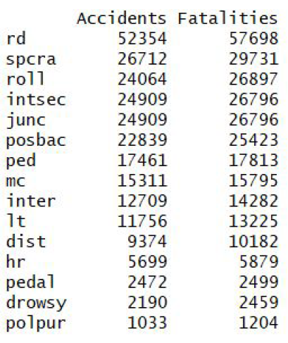
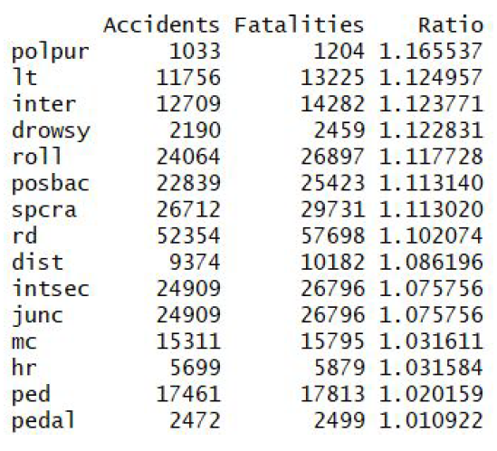
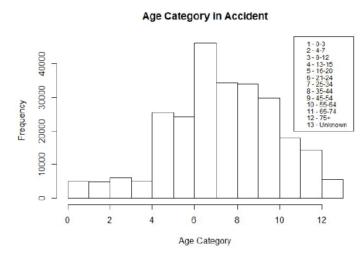
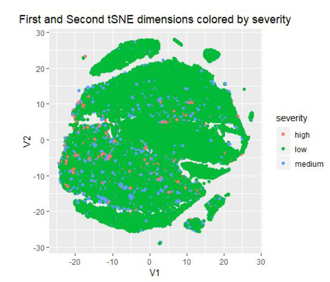
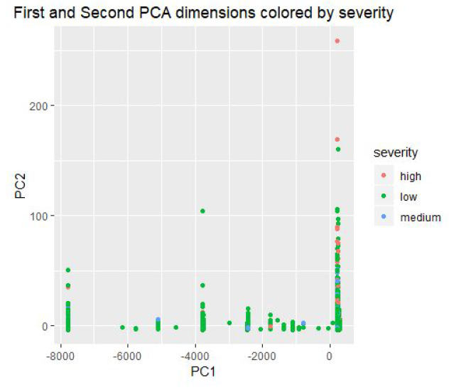

# Data Mining Final Project Report - Fatality Analysis
# Elena Gillis (emg3sc), Kanika Dawar (kd2hr), Varshini Sriram (vs4vx)

## 1. The Problem

### Introduction
Every year a large number of highway crashes occur that involve one or more fatalities per crash. There are
numerous factors that contribute to the situation, which can be influenced in order to impact the outcome. In
this project, we aim to identify the main factors of a fatal crash, predict the number of deaths, and contribute to
the understanding of the effectiveness of motor vehicle safety standards and highway safety programs.

### Descriptive Analysis
● Fatality Analysis Reporting System (FARS) is a nationwide census providing public yearly data
regarding fatal injuries suffered in motor vehicle traffic crashes. This data is critical to understanding the
characteristics of the environment, trafficway, vehicles, and persons involved in the crash.
 ● We aim to analyze data ranging from 2015-2017 obtained from National Highway Traffic Safety
Administration (NHTSA) website to help understand the factors contributing to car crashes and
subsequently influence the system to reduce the number of motor vehicle crashes and deaths on our
nation's highways. The data provides us with details of variables such as no of pax, drunk drivers,
vision, speed, etc which play an important role in helping us understand the chances of a fatal accident
occurring and what can and should be changed to impact the outcome.
 ● External events such as national holidays, dance and music concerts, etc. which have not been
explicitly taken into account could potentially have a significant impact and lead to bias in the analysis

### Normative Analysis
● Once the factors leading to fatal accidents are identified, measures can be taken to improve the road
regulations and safety conditions leading to fewer accidents and subsequently, to fewer fatalities

### Stakeholders
● NHTSA, General Public, Insurance Companies

### Impact
● Fewer casualties in vehicle crashes
 ● Reduction of economic loss

## 2. Objectives and Metrics

### Objectives
● Predict total fatal crashes for the year 2018
 ● Classify a fatal car crash into levels of accident severity - low/mid/high based on number of casualties
 ● Understand the most important factors for a car crash involving fatalities

### Metrics
● Mean Square error in prediction
 ● Misclassification error
 ● Relevance of factors identified with general government consensus

## 3. State-of-the-Art
● The following data sources were already investigated for traffic fatality analysis: NHTSA’s FARS,
FastFARS (FF), and Monthly Fatality Counts (MFC). FARS is a census of fatal traffic crashes. The FF
program is an Early Fatality Notification System to capture fatality counts from States more rapidly and
in real-time. The MFC data provides monthly fatality counts by State through sources that are
independent of the FastFARS or FARS systems.
 ● Data mining methods such as Time Series Analysis and Regression Techniques were applied to the
traffic data to predict fatality rates, to understand where crashes happen most often, what conditions
correlate with collisions and which road users are most vulnerable. [8]
 ● The methods have been evaluated using MSE. Ridge Regression proved to be the most successful
method in terms of predicting fatalities. ARIMA model worked best for forecasting fatality rates. [8]
 ● It’s hard to predict the fatalities in a car crash because of the wide number of factors involved. Even if
we identify the factors, it is hard to anticipate the predicted conditions. Incorporating the external factors
and enforcing safety regulations that are coherent with the factors identified makes it a difficult problem.
[9] [10]

## 4. Hypotheses and Approach

### Hypotheses
● We anticipate that factors such as usage of safety equipment, drunk driving, seasonality and light
conditions are the most common factors contributing to increased fatality rates.
 ● Data mining methods such as Decision Trees (Random Forest) will produce a better classification
accuracy compared to K-Nearest Neighbors and Support Vector Machine when applied to the data to
predict accident severity.
 ● Adding a seasonality factor to the model developed for monthly fatality will help explain peaks in
fatalities and better outlier detection.

### Data
● FARS - Reporting system by the NHTSA for fatal accidents - now provided for public use in the form of
CSV files and SAS database with additional information about specific environment variables.
 ● Bias in the data: Data might not accurately represent all crashes, another layer of non-fatal accidents
would have given more ground threshold in terms of the importance of factors and severity of an
accident. The lack of familiarity and understanding with the reporting system might have lead to
unintentional human errors (missing data, incomprehensible values, duplication, etc.).

### Methods
● Random Forest, K-Nearest Neighbors and Support Vector Machine for classification of the accident
severity level.
 ● Time Series Modeling for total fatal crashes prediction.
 ● Mostly only Exploratory Data Analysis has been done on traffic data and so there are not enough
resources to tell if any of the above methods have been applied to make predictions. We aim to explore
all the methods learnt in class and pick the method with the best outcome.

### Evaluation Setup
● Using Random Forest we perform feature selection and identify the most important variables that
contribute to higher numbers of fatalities.
 ● Using time series forecasting, we will predict the number of fatal crashes annually and compare the
result for 2018 when the FARS data is released.
 ● We will use cross-validation to check for misclassification error while predicting accident severity (ROC
curves, TPR and FPR trade-off).
 ● Ideally, we would have liked to classify severity into an extra level - a non-severe accident, but dataset
does not have that level because measurement by FARS is only for fatal accidents.
 ● Given that all methods work with minimal error, the models should be good predictors of the outcome
and, serve our initial intentions of contributing to understanding the factors leading to fatal crashes.

## 5. Approach and Results

### Problem
There are many factors that may influence the number of fatalities in each crash, as a result, historical data
from past crashes is collected by FARS in order to identify these factors. Vehicle crashes can be reduced by
studying the crash data and detailing the factors behind traffic fatalities. Nonetheless, since specific
combinations of these variables result in different levels of crash severity, it is difficult to anticipate all these
factors to come into play all at ones. In this project, we try to identify the most important factors that contribute
to fatal crashes and try to predict such results for future accidents.

### Data
We worked with the data from FARS ranging from 2015-2017. The data came from three separate datasets for
each year - accident cases, vehicles involved in the accident and person records for fatalities. We discovered
that all three datasets had the same number of unique accident cases for each year and combined the data
based on Year and Case Number. The total number of accidents over a span of three years is 101533. The
response variable selected was the number of fatalities per accident. The number of fatalities per accident in
our data ranged from 1-13. We converted this response variable to a categorical variable - accident severity
with three levels: low, medium and high. Low corresponds to one fatality per accident, medium corresponds to
two fatalities per accident and high corresponds to over two fatalities per accident. We discovered that the
distribution of levels in the categorical response suffered from severe class imbalance - Low severity (93%),
Medium severity (6%) and High severity (1%).

### Exploratory Data Analysis
The main datasets that we used were accidents data, to which we appended persons and vehicles data
aggregated on year and case number. When performing exploratory data analysis we checked trends in
response variable in relation to individual regressors. We discovered that more accidents (and more fatalities)
were happening during the weekdays and at night time. There are also more fatalities that happened in an
urban setting and close to main roadways. Most fatalities are recorded to have occurred in crashes that were
not classified as collisions with other motor vehicles in transport, nonetheless, when another vehicle was
involved, there were significantly more crashes and more fatalities in two-vehicle accidents. We could also
observe that there were more accidents and fatalities in crashes that involved young drivers (under the age of
24) and senior drivers (over the age of 65). To observe the patterns in the causes of crash data we created a
table that summarized accidents and fatalities per cause and saw that most fatalities happened on roadways,
in speeding crashes, on junctions or intersections, and involved driving under intoxication. However, when we
sorted these values by the ratio of the number of fatalities and accidents we saw that most fatalities per crash
occurred in crashes involving police pursuit, large trucks, interstate crashes, and drowsy or intoxicated drivers.

 

In exploring data from the vehicles datasets we have observed that the passenger cars formed the majority of
the fatal accidents with front-end collisions. Drivers of the commercial vehicles in the accidents had an invalid
commercial driving license and ten percent of drivers overall had invalid license compliance to the specific type
of vehicle they were driving, among which 50% of the motorcycle accidents involved a driver with an invalid
license type. Around 25% of our data involved accidents that resulted from speeding.

From the dataset on persons involved in each accident, we have seen that the majority of the accidents
distributed by age were clustered around young drivers (particularly 20-24 years old). In addition, 50% of the
drivers involved in an accident were tested for intoxication and out of these drivers, 33% were identified as
positive. We also see that in fatal motorcycle accidents the majority of drivers did not wear a helmet.
Most of the results that were discovered from data exploration were expected on the onset of the project, in
particular, factors such as the size of the vehicle, age, and intoxication of the drivers were important.

### Data Cleaning
The data that was downloaded from the FARS website was sufficiently cleaned and had no missing values,
however, we noticed that there were several columns with different breakdowns of the same variable. For
instance, the dataset on the persons involved in the accident had nine different classifications for age. We only
kept one of these classifications, the one that had the most categories. In addition, we aggregated the number
of people involved in each crash by counting the number of rows per crash number (since each row is
descriptive of one person involved). In the vehicles dataset, we removed the vehicle number (given that it is
unique for each row and does not provide significant information in the analysis) and aggregated the rest of the
data on year and case number (averaging out the year of the vehicle model for all the vehicles involved into the
crash). Similarly, from the main accidents dataframe, we removed additional variables for age and variables for
region and county, which had a large number of classifications and did not show to be significant. After the
initial cleaning steps, we performed one-hot encoding on all three datasets and allocated a separate column for
each category of each variable. In the end, all three datasets aggregated of year and case number had the
same number of rows and we column-merged them based on these parameters. This gave us a dataframe
with 101533 observations and 185 variables, which we used for further analysis.

### Exploring the high-dimensional Data
To understand and explore the relationships between the features and to look for patterns in the data, we
performed Dimensionality Reduction - Principal Component Analysis and t-Distributed Stochastic Neighbor
Embedding and visualized the outputs for the two methods.

We noticed that t-SNE has tried to separate the different points confirming that the data is separable and the
classification methods should work well for the data.

### Methods
To predict the severity of an accident, we built three classification models - Random Forest, K-Nearest
Neighbors and Support Vector Machine.
● H2O library was used for the random forest algorithm. We randomly split the data into train and test,
ran the algorithm of train data with 50 trees and performed 10-fold validation when running the code.
The resulting accuracy from random forest was 99.81% with only 61 observations in low severity and
36 observations in medium severity misclassified. All high severity accidents were predicted with 100%
accuracy.

● Similarly, we used the gbm library to run boosting algorithm on the data. We split the data into test and
train sets of equal length, ran the gbm model with multinomial distribution and chose the result that
gives us the highest classification probability. This model was also run on 50 trees and produced the
accuracy of 99.82%, misclassifying only 44 observations with low severity, 47 observations with
medium severity, and predicting high severity observations with perfect accuracy.

● A KNN model was then used to perform classification with the important variables as found from the
results of Random Forest Algorithm. Data splitting - train and validation sets was carried out to evaluate
the model performance. The KNN algorithm was fit to the train data with a repeated 10-fold
cross-validation and the optimum k value (k = 23) was chosen using the Log Loss metric since the
response variable suffered from severe class imbalances. The chosen model was tested on the
validation data and the classification accuracy obtained was 94.07%

● We used support vector machines to perform classification of severity level of fatalities using the 59
variables we found significant by performing random forest importance function. We used the e1071
library + parallel processing using doparallel and foreach packages whereas for radial kernel we used
the parallelSVM package. We tried the linear kernel with cost values of (0.001, 0.01, 0.1, 1, 5, 10, 100)
for each of gamma varying from (0.5, 1, 2, 3, 4) and performed 4-fold cross validation. We found the
most optimum results with cost value of 0.01 and gamma making little difference in the area under the
ROC curve (maximum being for gamma =2) at 0.978. While running svm cross validation for radial
kernel, we could not do it for a lot of values as the system was not able to perform operation on this big
a dataset. We did 80:20 split to form the train and test dataset. We found out that the radial kernel
performed much better than the linear kernel at cost =1 and gamma = 1 with 99.39% accuracy.

### Time Series Forecasting
To project the total fatal crashes for the year 2018, we performed a time series analysis of the total fatal
crashes from the year 1982 to 2017.

Fitting an ARIMA model requires the series to be stationary. A series is said to be stationary when its mean,
variance, and autocovariance are time invariant. The Augmented Dickey-Fuller Test (ADF test) was used to
test for stationarity. The null hypothesis assumes that the series is non-stationary and was not rejected,
confirming that the time series was not stationary. The non-stationary series can be corrected by differencing
the series while fitting the ARIMA model. An ARIMA model was fit for the years 1982-2015 and was evaluated
for the years 2016-2017. The optimal parameters for the fitted ARIMA model were differencing of degree one
and autoregressive of lag one. We checked for the model adequacy by examining the ACF and PACF plots for
model residuals and found that there was no significant autocorrelations present.

The RMSE after evaluating the model was found to be 885.0426. The ARIMA was refit for the entire data and
forecasting was done for the year 2018. The total fatal crashes will decrease to 34046 for the year 2018
according to the prediction made by the ARIMA model.

### Conclusions
The factors that were identified by the Random Forest model such as Non-Helmeted, Positive BAC in Alcohol
Testing, Unrestrained and Size of the vehicle (Truck) confirmed with our initial hypotheses. Factors such as
Head-on Collision, Front Initial Impact, Urban setting, Week of the day and Time confirmed with the results
obtained from the exploratory data analysis. In addition to this, the model also identified factors such as Invalid
License Status, No Roadway Departure and a particular roadway function class (Principal arterial). The age
group though was not an important factor as hypothesized from the Exploratory Analysis.
Being able to predict the determining factors of the severity of this crash will help in reducing the number of
crashes with high severity and the number of fatal crashes overall. We believe we were able to successfully
identify the main parameters resulting in high levels of fatalities given the data that was collected by FARS.
Nonetheless, predicting the existence of the conditions contributing to main factors presents the challenge of
its own - this data was not a part of out dataset and, as a result, was not in the scope of this project. However,
we believe that analysing such data could be a significant contributing factor in achieving the desired outcome
in practice.

## References
[1] Crashstats.nhtsa.dot.gov. (2018). [online] Available at:
https://crashstats.nhtsa.dot.gov/Api/Public/ViewPublication/812633 [Accessed 10 Dec. 2018].
 [2] Catalog.data.gov. (2018). Fatality Analysis Reporting System ( FARS ) - FTP Raw Data - Data.gov . [online] Available
at: https://catalog.data.gov/dataset/fatality-analysis-reporting-system-fars-ftp-raw-data-8f8bd [Accessed 10 Dec. 2018].
 [3] Dalinina, R. (2018). Introduction to Forecasting with ARIMA in R . [online] Datascience.com. Available at:
https://www.datascience.com/blog/introduction-to-forecasting-with-arima-in-r-learn-data-science-tutorials [Accessed 10
Dec. 2018].
 [4] Medium. (2018). DAY 10: Dimensionality Reduction with PCA and t-SNE in R . [online] Available at:
https://medium.com/@TheDataGyan/dimensionality-reduction-with-pca-and-t-sne-in-r-2715683819 [Accessed 10 Dec.
2018].
 [5] Rdocumentation.org. (2018). parallelSVM function | R Documentation . [online] Available at:
https://www.rdocumentation.org/packages/parallelSVM/versions/0.1-9/topics/parallelSVM [Accessed 10 Dec. 2018].
 [6] R-bloggers. (2018). Improve SVM Tuning through Parallelism . [online] Available at:
https://www.r-bloggers.com/improve-svm-tuning-through-parallelism/ [Accessed 10 Dec. 2018].
 [7] NHTSA. (2018). Research & Data . [online] Available at: https://www.nhtsa.gov/research-data [Accessed 10 Dec.
2018].
 [8] Etd.ohiolink.edu. (2018). [online] Available at:
https://etd.ohiolink.edu/!etd.send_file?accession=bgsu1491397270639027&disposition=inline [Accessed 10 Dec. 2018].
 [9] Edmonds, L. (2018). U.S. Fatal Collision Data Set (2015) . [online] Rstudio-pubs-static.s3.amazonaws.com. Available
at: https://rstudio-pubs-static.s3.amazonaws.com/234137_75fb6fe28ba646f1a5c4ac3826e294fb.html [Accessed 10 Dec.
2018].
 [10] Kaggle.com. (2018). MDST FARS Dataset Challenge | Kaggle . [online] Available at:
https://www.kaggle.com/c/mdst-fars [Accessed 11 Dec. 2018].

 Link to the data used in the project :
ftp:// ftp.nhtsa.dot.gov/fars/
